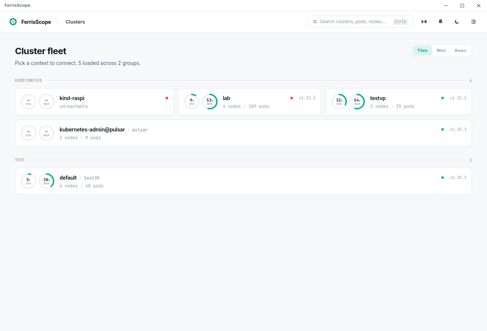
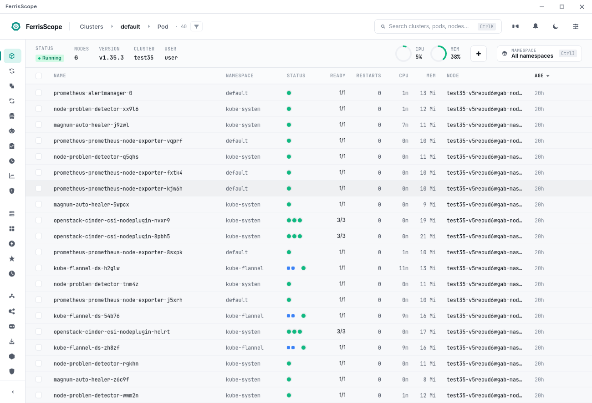
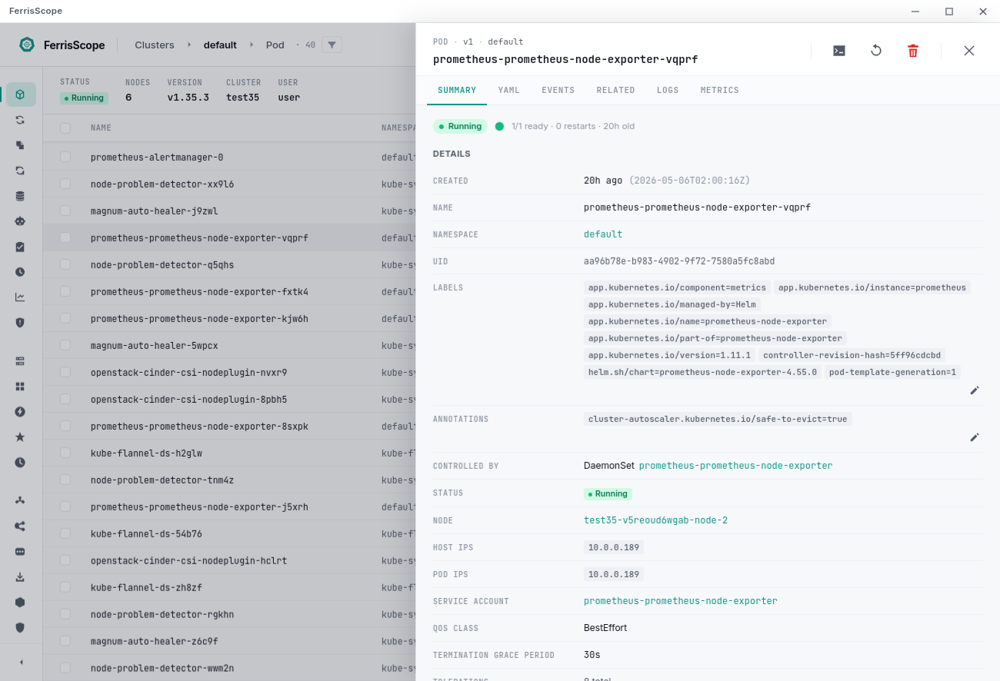
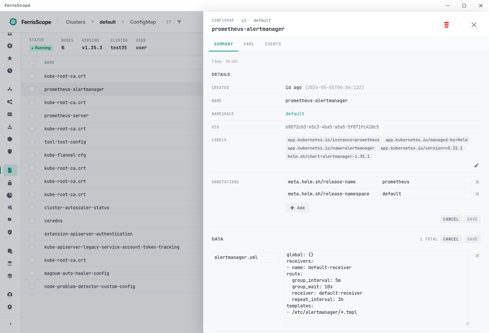
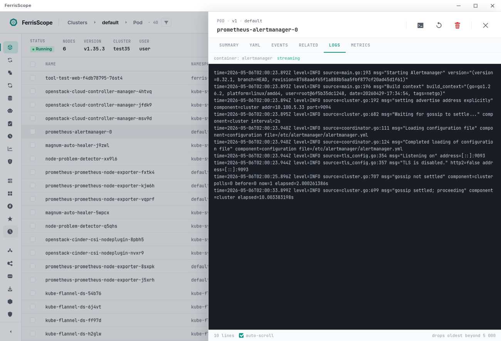
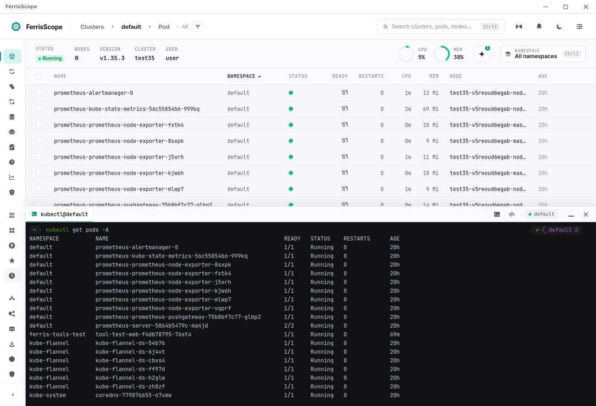
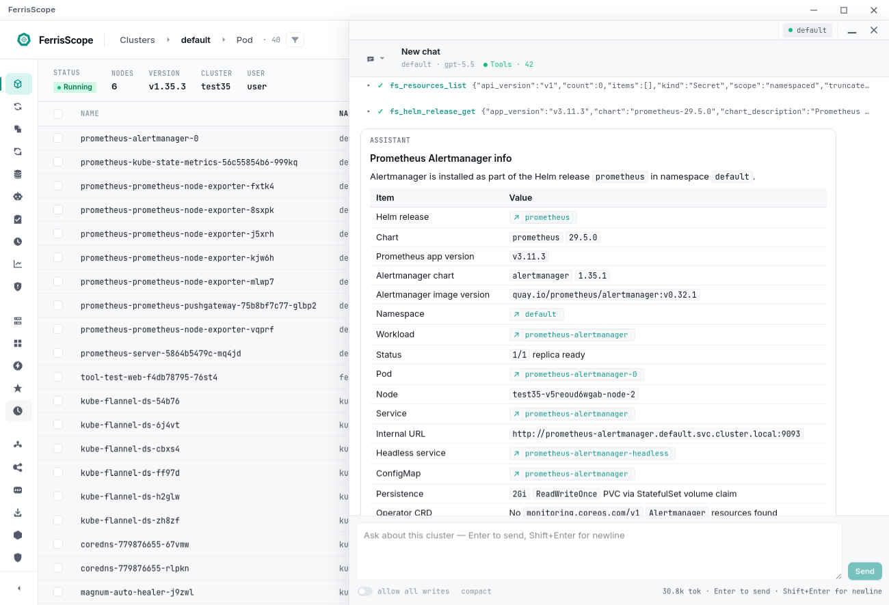
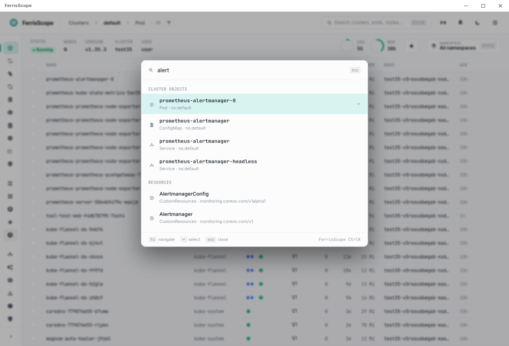

<div align="center">


# FerrisScope

**A Rust-native, open-source desktop IDE for Kubernetes.**
A lightweight Lens replacement built on Tauri 2 + `kube-rs` + React.

[](https://github.com/dzcorp/FerrisScope/actions/workflows/ci.yml)
[](https://github.com/dzcorp/FerrisScope/releases)
[](./LICENSE)
[](#install)
[](https://www.rust-lang.org)
[](https://aur.archlinux.org/packages/ferrisscope-bin)

[Install](#install) · [Features](#what-you-get) · [Why](#why-another-kubernetes-ide) · [Develop](#develop) · [Architecture](#architecture) · [Roadmap](#roadmap)

</div>

---

## Screenshots

<table>
  <tr>
    <td><a href="screenshots/01-fleet.png"></a></td>
    <td><a href="screenshots/02-resource-table.png"></a></td>
  </tr>
  <tr>
    <td><a href="screenshots/03-detail-panel.png"></a></td>
    <td><a href="screenshots/04-edit-ssa.png"></a></td>
  </tr>
  <tr>
    <td><a href="screenshots/06-logs.png"></a></td>
    <td><a href="screenshots/07-terminal.png"></a></td>
  </tr>
  <tr>
    <td><a href="screenshots/09-agent-chat.png"></a></td>
    <td><a href="screenshots/10-command-palette.png"></a></td>
  </tr>
</table>

---

## Why another Kubernetes IDE?

Lens is the de-facto desktop IDE for Kubernetes, but it bundles an entire Chromium runtime, runs business logic in the renderer, and the open-source build has been pared back over time. FerrisScope keeps the desktop UX but moves the engine into Rust:

- **Tiny shell.** Tauri 2 uses the system webview (~10–40 MB) instead of bundling Chromium.
- **One reflector per `(cluster, kind)`.** Watches are shared, started lazily on first subscribe, torn down a few seconds after the last unsubscribe. No duplicate watches, no orphaned tasks.
- **Frontend is a mirror, not a source of truth.** All canonical state lives in Rust. The renderer is a thin view over typed Tauri commands and event streams.
- **No bundled monitoring stack.** We *consume* whatever Prometheus / VictoriaMetrics / Thanos / Mimir / Cortex / M3 the operator already has — we never deploy one.
- **Engine is reusable.** `crates/core` has no Tauri dependency, so a future TUI or CLI can sit on the same engine.
- **Pure-Rust SSH for kubeconfig sources.** No `/usr/bin/ssh` shell-out; passphrases live in the OS keychain, never on disk.
- **`unsafe_code = "forbid"`, `panic = "abort"`, rustls-only with `ring`.** No aws-lc-rs, no OpenSSL variants, no unwind tables in the release binary.

## What you get

### Cluster operations
- **Multi-source kubeconfigs.** Default kubeconfig + user-added files, folder scans, and SSH-mounted remote configs. Live FS watcher reloads on change. Each context gets a stable `(source, name)` id so duplicate names across files never collide.
- **Fleet landing.** Per-cluster cards with cached probes (server version, node count, pod count, CPU / Mem load). Refresh is best-effort and never clears the last known good values.
- **Auth-plugin diagnostics.** `gke-gcloud-auth-plugin` / `aws-iam-authenticator` / OIDC failures surface clearly — silent auth failures are the #1 Lens UX papercut we wanted to fix.

### Resource browsing — 50+ kinds, reflector-backed
| Category | Kinds |
|---|---|
| **Workloads** | Pod, Deployment, ReplicaSet, StatefulSet, DaemonSet, Job, CronJob, ReplicationController, HorizontalPodAutoscaler, PodDisruptionBudget |
| **Network** | Service, Endpoints, EndpointSlice, Ingress, IngressClass, NetworkPolicy |
| **Config** | ConfigMap, Secret, ResourceQuota, LimitRange |
| **Storage** | PersistentVolume, PersistentVolumeClaim, StorageClass |
| **Access** | ServiceAccount, Role, RoleBinding, ClusterRole, ClusterRoleBinding |
| **Cluster** | Node, Namespace, Event, Lease, PriorityClass, MutatingWebhookConfiguration, ValidatingWebhookConfiguration |
| **Apps** | Helm releases (read from `helm.sh/release.v1` Secrets) and discovered charts |
| **Custom Resources** | Dynamic CRD discovery + browseable instances |
| **Well-known CRDs** | Gateway API today (GatewayClass / Gateway / HTTPRoute / GRPCRoute / ReferenceGrant) — first-class category, columns, and detail panel without a typed crate per ecosystem |

### Detail panels & inline editing (Server-Side Apply)
- Kind-agnostic detail primitives: copyable values everywhere, cross-kind LinkValue navigation (owner refs, node names, service-account refs, image-pull-secret refs, volume sources), key/value chip strips, condition chips with invert support for "True is bad" conditions, sub-grids for nested structs.
- **SSA editing** for ConfigMap data, Secret data, ResourceQuota hard limits, LimitRange items, plus Labels and Annotations on opted-in kinds. Stable field manager (`"ferrisscope"`) so per-field ownership tracking actually works across releases.
- **Conflicts surface as a banner** with a visible *Force takeover* action — never defaulted on. You always see the colliding manager and field paths first.
- **YAML viewer / editor** (Monaco) for any resource. Apply via SSA or copy out.

### Live data — logs, metrics, terminal, port-forwards
- **Live logs** with backpressure-safe streaming and `LogLine::Lagged` markers for slow consumers; ANSI-colored, virtualized, ring-buffered to 5 000 lines.
- **Metrics** from metrics-server (CPU / mem per pod and node) plus per-pod and per-PVC volume usage scraped via the kubelet `/stats/summary` proxy. Falls back to `available: false` snapshots when metrics-server is missing — no fake spinners.
- **Prometheus-API metrics** via apiserver proxy — discovery by service labels, instant + range queries, vendor badge (Prom / VM / Thanos / Mimir / Cortex / M3).
- **Embedded terminal** (xterm.js + portable-pty): pod shell, exec, kubectl. Survives window resizes; Cmd+\` spawns a shell pre-pointed at the active context.
- **Port-forwards.** Pinned forwards persist across restarts and re-bind on next launch; the listener resolves Service / Deployment / StatefulSet / DaemonSet / ReplicaSet / Job to a backing pod per connection so it survives pod restarts. Ephemeral forwards opened from a detail panel live in memory only.

### Cluster mutation
- **Helm.** Install / upgrade / uninstall (when the `helm` binary is on PATH), repo-update, release detail with revision history.
- **Node operations.** Cordon / uncordon, drain (with `delete-emptydir-data`, `ignore-daemonsets`, force flags).
- **Workload restart.** Rollout-style restart for Deployments / StatefulSets / DaemonSets, plus single-pod owner-aware restart.

### AI agent — multi-provider, native in-process toolkit, optional MCP
- **10 providers, one config shape.** OpenRouter, Anthropic, OpenAI (key + OAuth + Codex Responses for ChatGPT subscriptions), Z.AI, MiniMax, Groq, DeepSeek, Mistral, Together.ai, Ollama. API keys stored in the OS keychain by default.
- **Native in-process tools** (`fs_*`) — full Kubernetes management surface, no external binary required. Pods (list/get/delete/run/exec), arbitrary GVK resources (list/get/delete/scale/apply), nodes (kubelet logs + stats summary + diagnose), namespaces, events, helm (list/get/history/install/uninstall), metrics (pod + node), prometheus query, log tail with selector fan-out, port-forward open/close/list, HTTP probe, SubjectAccessReview, SSA apply, configuration introspection, plus privileged node shell via debug pod and direct SSH fallback.
- **Optional external MCP server.** Operators can plug any MCP-protocol server (filesystem, github, custom) into a chat by setting `mcp_binary_path` — its tools merge with the native catalogue. Not bundled; not auto-installed.
- **Belt-and-braces TTLs.** Debug pods carry `activeDeadlineSeconds: 300`, agent-spawned Jobs carry `ttlSecondsAfterFinish` — the apiserver reaps orphans even if the chat crashes.
- **Approval is never silent.** Write tools always require explicit approval per call; operators can opt into `AllowAllWrites` per chat — never globally.

### Workspace UX
- **Command palette** (⌘K) with global cluster-resource search (FTS5), context switch, kind navigation, settings jump.
- **Theme tokens** flow one direction: design → `ui/src/theme.ts`. No hardcoded hex values across components. Light & dark, plus per-window UI scale (⌘+ / ⌘− / ⌘0).
- **Notifications panel**, port-forwards panel, namespace picker, bulk action bar.

### Distribution & updates
- **Multi-platform installers** — `.deb`, `.rpm`, `.AppImage` (Linux x64 + arm64); `.dmg` (macOS x64 + arm64); NSIS `.exe` and `.msi` (Windows x64).
- **AUR**: `ferrisscope-bin` auto-published from CI on every release.
- **In-app updater** for self-managed installs (AppImage, macOS bundle, Windows NSIS). Package-manager installs (apt / dnf / Homebrew / AUR) defer to the system tool with a clear hint instead of silently breaking.

## Install

**Linux** (Debian / Ubuntu / Fedora / RHEL / openSUSE / Arch / NixOS / …):

```bash
curl -fsSL https://raw.githubusercontent.com/yzhelezko/FerrisScope/main/packaging/linux/install.sh | bash
```

The script picks `.deb`, `.rpm`, or `.AppImage` based on what's available on the host. Pin a version with `FERRISSCOPE_VERSION=v1.0.0 bash`. Uninstall with `... | bash -s -- --uninstall`. See [`packaging/linux/README.md`](./packaging/linux/README.md) for details.

**macOS** (Apple silicon and Intel):

1. Download the `.dmg` for your architecture (`-macos-arm64.dmg` or `-macos-x64.dmg`) from [Releases](https://github.com/dzcorp/FerrisScope/releases).
2. Open the DMG and drag *FerrisScope.app* into `/Applications`.
3. **First launch:** right-click (or Control-click) *FerrisScope.app* and choose **Open**. macOS will warn that the developer can't be verified — confirm once and the choice sticks. Builds are currently unsigned and unnotarized; manual approval unblocks Gatekeeper. (Notarization is on the v1.0 roadmap.)

   If macOS still refuses to open the app (e.g. *"FerrisScope.app is damaged and can't be opened"*, or **Open** is greyed out):

   ```bash
   sudo xattr -dr com.apple.quarantine /Applications/FerrisScope.app
   ```

**Arch / Manjaro / EndeavourOS** — install from the AUR:

```bash
yay -S ferrisscope-bin     # or: paru -S ferrisscope-bin
```

**Windows** (x64): download the `.exe` (NSIS installer) from [Releases](https://github.com/dzcorp/FerrisScope/releases) and run it. The installer is currently unsigned, so SmartScreen will warn on first run — click **More info → Run anyway**. The in-app updater handles future upgrades.

## Quick tour

1. **Launch FerrisScope.** It loads `~/.kube/config` and any extra sources you've added; if you've never used kubectl on this machine you'll land on an empty fleet view — that's fine.
2. **Pick a cluster** from the fleet landing or via ⌘K → "switch context".
3. **Browse** with the rail (left sidebar) — Workloads → Pods, Network → Services, etc. Tables are virtualized so 5 000-pod namespaces stay snappy.
4. **Open a detail panel.** Click any row. Cross-kind links (owner refs, node, service-account, mounted ConfigMaps / Secrets) navigate inline.
5. **Edit live.** ConfigMap, Secret, ResourceQuota, LimitRange, plus labels / annotations on opted-in kinds — pencil → edit → Save. Conflicts surface a banner with the colliding manager.
6. **Talk to the cluster.** Open the AI dock (right side) → pick a provider → ask "*why is this pod CrashLoopBackOff?*" The agent runs `fs_pod_diagnose`, pulls events, tails logs, and explains.

## Stack

- **Shell:** Tauri 2 (system webview, ~10–40 MB)
- **Backend:** Rust 1.94+, Tokio (audited feature set), [`kube-rs`](https://kube.rs) (`runtime`, `client`, `ws`, `config`)
- **Frontend:** React 19 + TypeScript 6 + Vite 8 + Tailwind 4 + Zustand 5
- **Editor:** Monaco
- **Terminal:** xterm.js + portable-pty
- **Tables:** TanStack Table + TanStack Virtual
- **Search index:** rusqlite + FTS5 (bundled SQLite so macOS predates-FTS5 doesn't matter)
- **SSH:** russh (pure Rust async SSH-2)
- **Targets:** Linux x64/arm64, macOS x64/arm64, Windows x64.

## Layout

```
crates/
  core/        # cluster engine: kubeconfig, watchers, fleet probes, metrics,
               # Prometheus, port-forwards, prefs, search index. No Tauri deps.
  kube-ext/    # helpers on top of kube-rs: row + detail projections, resource
               # registry, generic dynamic watcher, well-known CRD overrides,
               # fetch / apply / delete / drain / restart.
  agent/       # Tauri-free agent crate: provider abstraction, MCP client,
               # native-tool trait, approval gate.
  app/         # Tauri 2 binary: commands, event bridge, terminal PTYs, app
               # state, in-app updater, native agent tools.
  test-support/  # fixtures + helpers for unit + integration tests.
ui/            # Vite + React frontend. Thin renderer over typed Tauri commands.
design/        # Helmsman v2 reference (read-only — source of truth for layout,
               # spacing, motion, tokens). See ./design/icon.md for icon spec.
packaging/
  linux/       # Universal install.sh (.deb / .rpm / .AppImage selector).
.github/
  workflows/   # ci.yml, release.yml (multi-platform bundles + AUR publish).
```

## Architecture

These rules are enforced — see [`CLAUDE.md`](./CLAUDE.md) for the full set:

- **One reflector per `(cluster, resource_kind)`.** Never start a second watch for data already cached.
- **Reflectors are lazy.** Started on first subscribe, torn down a few seconds after the last unsubscribe.
- **A "cluster" owns a task supervisor.** Disconnecting aborts the supervisor — no orphaned tasks, no leaked sockets.
- **`core` has no Tauri dep.** If you find yourself adding `tauri` to `core/Cargo.toml`, stop and reconsider.
- **No `unwrap()` outside tests.** `thiserror` in libraries, `anyhow` in the binary, `tracing` everywhere.
- **TS `strict: true`, no `any`.** Tauri command bindings flow through the typed wrapper in `ui/src/api.ts`.
- **All edits are SSA with a stable field manager.** No per-kind apply functions — the dynamic API covers every kind in the registry.
- **Auth-plugin failures (gke / aws / oidc) surface as diagnostics, never silent.**

## Develop

Prereqs:

- Rust ≥ 1.94 (stable)
- Node ≥ 22 LTS
- On Linux: `webkit2gtk-4.1`
- Optional: `helm` binary on PATH for Helm install / upgrade / uninstall

```bash
make install        # one-time: npm deps for ui/
make dev            # vite + tauri (auto-detects Linux render path)
make dev-x11        # force XWayland with GPU acceleration (NVIDIA fallback)
make dev-safe       # conservative: WebKitGTK DMA-BUF + compositing off
```

On Linux the binary picks a render path at startup. Default is GPU-accelerated WebKitGTK (DMA-BUF + compositing on); on NVIDIA + Wayland it additionally sets `__NV_DISABLE_EXPLICIT_SYNC=1` to dodge the EGL-Wayland explicit-sync race that crashes WebKit on Plasma 6 / KWin. The chosen mode is logged once at startup as `linux render: mode=… vendor=… session=… applied=[…]`. If you hit a blank window or a crash on first paint (typically older NVIDIA proprietary or broken Mesa stacks), set `FERRISSCOPE_SAFE_MODE=1` or run `make dev-safe`.

`make help` lists everything. Common targets: `check`, `clippy`, `test`, `build-release`, `bundle`.

The Tauri CLI ships via npm (`@tauri-apps/cli`) and runs through the `tauri` script in `ui/package.json`. The `Makefile` invokes `ui/node_modules/.bin/tauri` directly so its project search starts at the repo root (`npm --prefix ui run tauri` would chdir into `ui/` first and miss `crates/app/tauri.conf.json`).

### Build & test

```bash
make check             # cargo check --workspace + tsc --noEmit
make clippy            # cargo clippy --workspace -- -D warnings
make test              # cargo test --workspace
make test-frontend     # vitest run
make test-all          # backend + frontend
make build-release     # release build (frontend bundled)
make bundle            # produce installable bundles via `tauri build`

# integration tests against a kind cluster (Docker required)
cargo test --workspace --features integration -- --test-threads=1
```

CI runs `cargo fmt --check`, clippy `-D warnings`, the workspace test suite on Linux + macOS + Windows, and integration tests against two Kubernetes versions. See [`.github/workflows/ci.yml`](./.github/workflows/ci.yml).

### Release flow

Tag a commit with `vX.Y.Z` and push — [`.github/workflows/release.yml`](./.github/workflows/release.yml) builds Linux x64/arm64, macOS x64/arm64, and Windows x64 bundles in parallel, publishes the GitHub Release, and updates the AUR `ferrisscope-bin` package. Manual `workflow_dispatch` runs are also supported for off-cycle bundles.

## Design system

The visual + interaction reference lives in [`./design/Helmsman v2/`](./design) (`hv2-rail.jsx`, `hv2-dock.jsx`, `hv2-settings.jsx`, `hv2-ui.jsx`, plus `Helmsman v2.html` and `Helmsman v2 - Design principles.html` for previews). It's the **source of truth** for layout, spacing, colors, motion, and component anatomy. Tokens flow one direction: design → `ui/src/theme.ts`. Don't edit `design/` directly — push divergences back into the relevant atom in `ui/src/components/ui/`.

Icons follow a single solid-filled, geometric style (24×24 viewBox, `fill="currentColor"`, no strokes). All glyphs live in `ui/src/components/ui/icons.tsx` (`Icons` for utility, `KindIcons` per Kubernetes kind). See [`design/icon.md`](./design/icon.md) for the spec.

## Contributing

Contributions are welcome — bug reports, fixes, well-known CRD overrides, new kind detail panels, agent tools, packaging recipes. See [`CONTRIBUTING.md`](./CONTRIBUTING.md) for setup, the architectural rules above (and in [`CLAUDE.md`](./CLAUDE.md)), the conventional-commits style we use, and the PR checklist. By contributing you agree to release your changes under Apache-2.0.

If you find a security issue, please do **not** open a public issue — see [`SECURITY.md`](./SECURITY.md) for responsible disclosure.

## Acknowledgments

FerrisScope stands on the shoulders of:

- [`kube-rs`](https://kube.rs) — the Kubernetes client + runtime that makes the engine possible.
- [Tauri](https://tauri.app) — the lightweight desktop shell.
- [`russh`](https://github.com/Eugeny/russh) — pure-Rust async SSH-2 client.
- [Monaco Editor](https://microsoft.github.io/monaco-editor/), [xterm.js](https://xtermjs.org/), [TanStack](https://tanstack.com/), and the React + Vite + Tailwind ecosystem.
- The Lens project, for proving the desktop-IDE-for-K8s shape works — and for the UX papercuts that motivated this rewrite.

## License

Licensed under the [Apache License, Version 2.0](./LICENSE).
